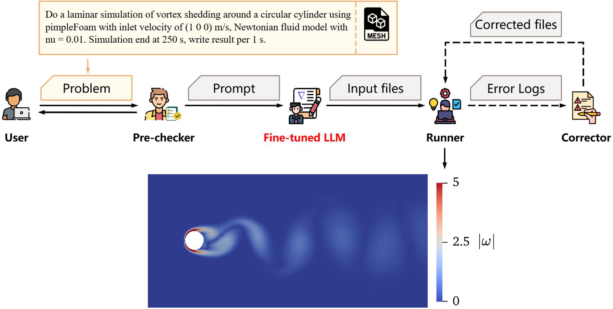
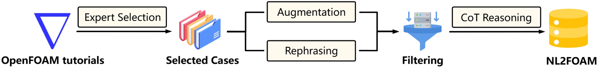
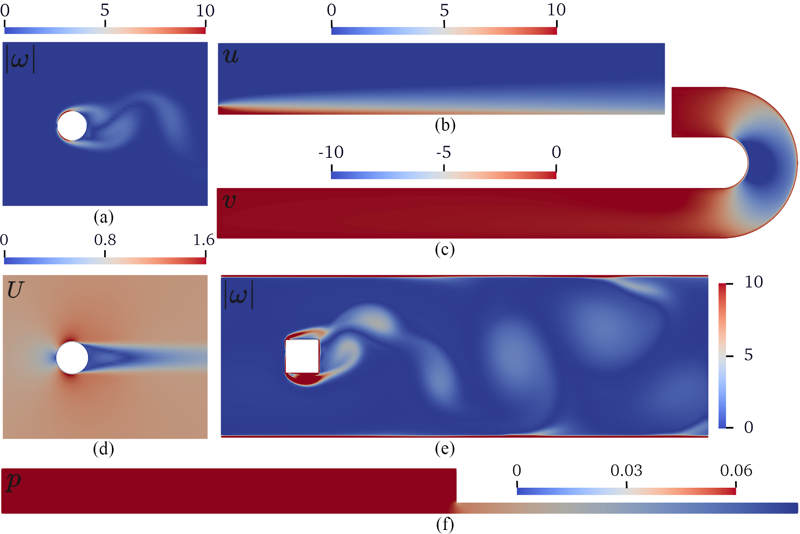
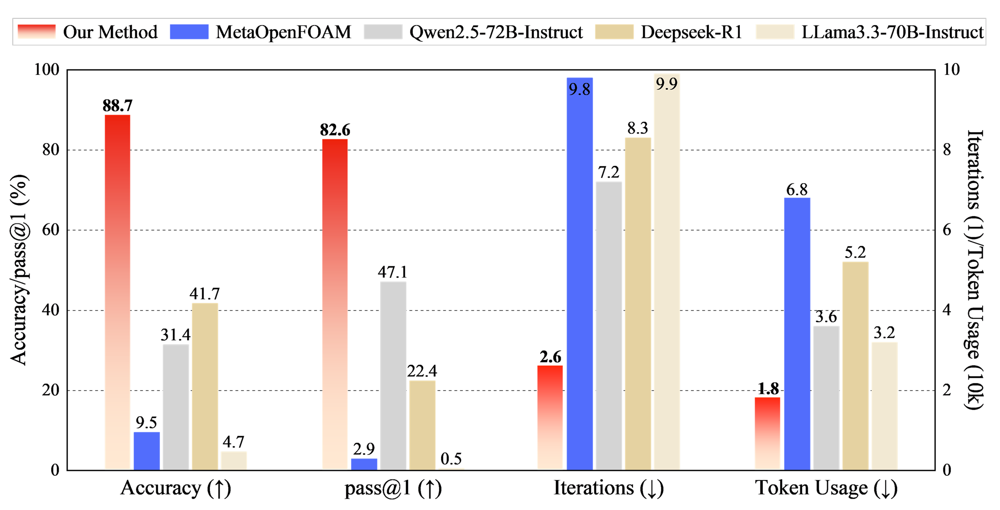

# Fine-tuning an Large Language Model for Automating Computational Fluid Dynamics Simulations

## Overview

In this work, we developed a domain-specific fine-tuned LLM for automating CFD workflows. We developed NL2FOAM, a custom dataset comprising 28716 pairs of natural language descriptions and corresponding OpenFOAM configurations, augmented with chain-of-thought (CoT) annotations to capture expert reasoning. Using NL2FOAM, we fine-tuned Qwen2.5-7B-Instruct, enabling it to translate high-level natural language problem descriptions into executable CFD setups. A multi-agent framework manages the workflow, handling input verification, configuration generation, simulation execution, and error correction autonomously. 



Figure 1: The multi-agent framework for automated CFD simulation, centered on a fine-tuned LLM. The workflow progresses from user input through a pre-checker, LLM-based generation of input files, simulation execution by the runner, and an iterative error correction loop involving the corrector, ultimately producing simulation results.




Figure 2: NL2FOAM construction pipeline. From 16 curated OpenFOAM cases, automated tools modify input files (controlDict, fvScheme, and fvSolution) to create 100k variations, while an LLM enhances linguistic diversity through description rephrasing.
Simulation testing eliminates cases with errors, solution divergence, or excessive runtime, followed by CoT reasoning to structure solutions.




Figure 3: Simulation results from benchmark cases generated using our automation workflow based on the fine-tuned LLM.




Figure 4: Benchmark performance of different methods, comparing our method against four baselines (MetaOpenFOAM, Qwen2.5-72B-Instruct, Deepseek-R1, and LLama3.3-70B-Instruct) across accuracy, pass@1, iterations, and token usage. 

## Model

Model Download Links: [Huggingface](https://huggingface.co/YYgroup/AutoCFD-7B)


## Datasets

Datasets Download Links: [Huggingface](https://huggingface.co/datasets/YYgroup/NL2FOAM)


## Requirements

- Python >= 3.9
- MetaGPT v0.8.0
- OpenFOAM 2406

### Step 1: Setup Python Environment

1. Create a Python >= 3.9 environment. In this example, we'll create a Python 3.11.4 environment in a directory called `your_dir`.

    ```bash
    conda create --prefix your_dir python=3.11.4
    ```

2. Activate the environment.

    ```bash
    conda activate your_dir
    ```

3. Verify the Python version.

    ```bash
    python --version
    ```

### Step 2: Setup MetaGPT

1. Create a new working directory called `MetaOpenFOAM_path` and navigate to it.

    ```bash
    mkdir MetaOpenFOAM_path
    cd MetaOpenFOAM_path
    ```

2. Clone the MetaGPT repository and install the development version.

    ```bash
    git clone https://github.com/geekan/MetaGPT.git
    cd MetaGPT
    pip install -e .
    ```

### Step 3: Setup OpenFOAM

1. After installing OpenFOAM 2406, activate the OpenFOAM environment.

    ```bash
    source OpenFOAM_PATH/openfoam2406/etc/bashrc
    ```

2. Verify the environment activation.

    ```bash
    echo $WM_PROJECT_DIR
    ```

### Step 4: Installation

For development, you can clone the repository and install it locally.

```bash
git clone https://
cd OpenFOAM_Agent
```

## Quickstart

```bash
case_name=xxx
export CONFIG_FILE_PATH=Benchmark/${case_name}.yaml
python src/main.py > logs/${case_name}.log
```


## Citation
If you find our work useful, please consider citing us!

```bibtex
@article{Dong2025,
  title = {Fine-Tuning a Large Language Model for Automating Computational Fluid Dynamics Simulations},
  author = {Dong, Zhehao and Lu, Zhen and Yang, Yue},
  year = {2025},
  journal = {Theoretical and Applied Mechanics Letters},
  volume = {15},
  pages = {100594},
  doi = {10.1016/j.taml.2025.100594}
}
```

## Acknowledgement

This repo benefits from [MetaOpenFOAM]([Terry-cyx/MetaOpenFOAM: MetaOpenFOAM: an LLM-based multi-agent framework for CFD](https://github.com/Terry-cyx/MetaOpenFOAM)) and [MetaGPT]([geekan/MetaGPT: 🌟 The Multi-Agent Framework: First AI Software Company, Towards Natural Language Programming](https://github.com/geekan/MetaGPT)). Thanks for their wonderful works.
